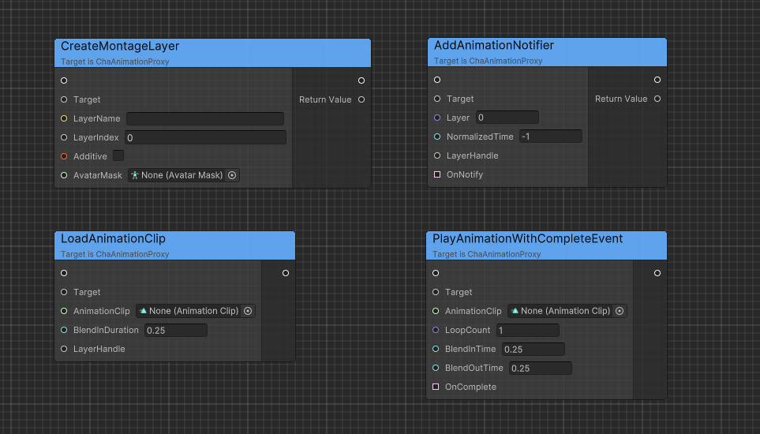
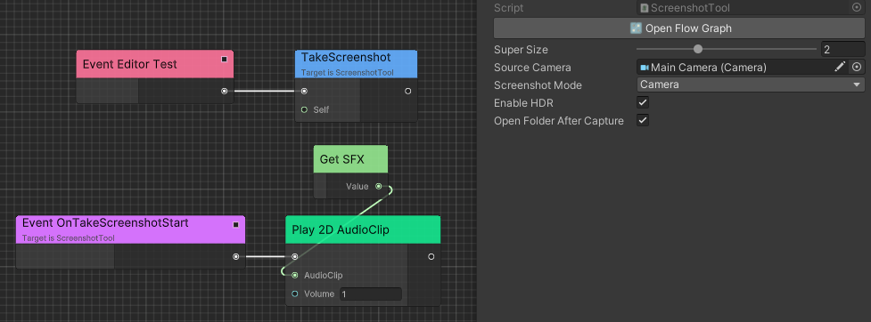
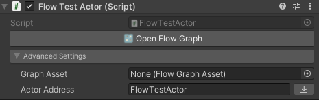

# Gameplay

Based on Ceres to integrate visual scripting and C#. Also contains some tools that may be useful.

## Gameplay Architecture

Gameplay architecture is quite simple like Unreal.

### GameWorld

`GameWorld` is a gameplay level manager of scenes.

### Subsystem

`WorldSubsystem` is a singleton for each `GameWorld`.

### Actor

`Actor` is a gameplay level entity and is managed by `GameWorld`.

## Animation Proxy

`AnimationProxy` is a wrapper of `Animator` to play montage and sequence by script directly.

- Use `AnimationProxy` to play montage by `RuntimeAnimatorController` and `AnimationClip`.
- Support multi layers.
- Support subscribe events.
- Support visual scripting.



### AnimationProxy Example

```C#
public class MontageExample : MonoBehaviour
{
    public Animator animator;
    private AnimationProxy animationProxy;
    public RuntimeAnimatorController controllerA;
    public RuntimeAnimatorController controllerB;
    private IEnumerator Start()
    {
        animationProxy = new AnimationProxy(animator);
        animationProxy.LoadAnimator(controllerA, 0.5f); /* Crossfade animator to controllerA in 0.5s */
        yield return new WaitForSeconds(1f);
        animationProxy.LoadAnimator(controllerB, 0.5f); /* Crossfade controllerA to controllerB in 0.5s */
        yield return new WaitForSeconds(1f);
        animationProxy.Stop(0.5f); /* Crossfade controllerB to animator in 0.5s */
    }
}
```

### SequenceBuilder Example

```C#
public class SequenceExample : MonoBehaviour
{
    public Animator animator;
    private AnimationProxy animationProxy;
    public AnimationClip[] clips;
    private void Start()
    {
        animationProxy = new AnimationProxy(animator);
        using var builder = animationProxy.CreateSequenceBuilder();
        foreach (var clip in clips)
        {
            builder.Append(clip, clip.length * 3 /* Play 3 loop */, 0.25f /* BlendIn duration */);
        }
        builder.SetBlendOut(0.5f);
        builder.Build().Run();
    }
}
```

### Debugging

Recommend to use [Unity PlayableGraph Monitor](`https://github.com/SolarianZ/UnityPlayableGraphMonitorTool`).

## Audios and FX

`AudioSystem` and `FXSystem` are designed to manage audio and fx within a scene using a general pooling method based on `Chris.Pool`.

- Support load from Addressables.
- Support visual scripting.
- Allocation optimization.


## Capture

`ScreenshotTool` is a tool for taking screenshot in game and editor, intergrated with `Ceres.Flow`.

Support two kinds of modes:

1. Capture from camera.
2. Capture from screen color buffer.



## Actor Hotupdate

`Actor` is integrated with `Ceres.Flow` to support implementing logic in visual scripting.

Here is a simple example of how to implement a hotupdateable actor.

1. Create a `DataTable` named `ActorFlowGraphDataTable`.
2. Set `Row Type` to `Chris.Gameplay.ActorFlowGraphRow` and the dataTable will be automatically registered to Addressables.
3. Assign an address to `Advanced Settings/Actor Address` in your actor.

    

4. Create a new row in `ActorFlowGraphDataTable` and set `Row Id` to the address you assigned in step 3.

    

5. Enable `Remote Update` and overwrite remote update path if need.
6. Edit your actor flow graph and click `Save`.
7. Click `Download` button in `Advanced Settings` to export asset as an assetbundle.

    

    > [!TIP]
    > You can set `Remote Update/Serialize Mode` to `PreferText` in `Project Settings/Chris/Gameplay Settings` to export asset as a text file if has no asset dependencies for better readability.

8. Drag the bundle to `{Saved Path}/Flow` to update the actor.

### Saved Path

Saved path mentioned above is different for different platforms.

| Platform    | Path                            |
| ----------- | :-----------------------------: |
| Windows     | `Build Path`/Saved              |
| Android     | `Persistent Data Path`/Saved    |