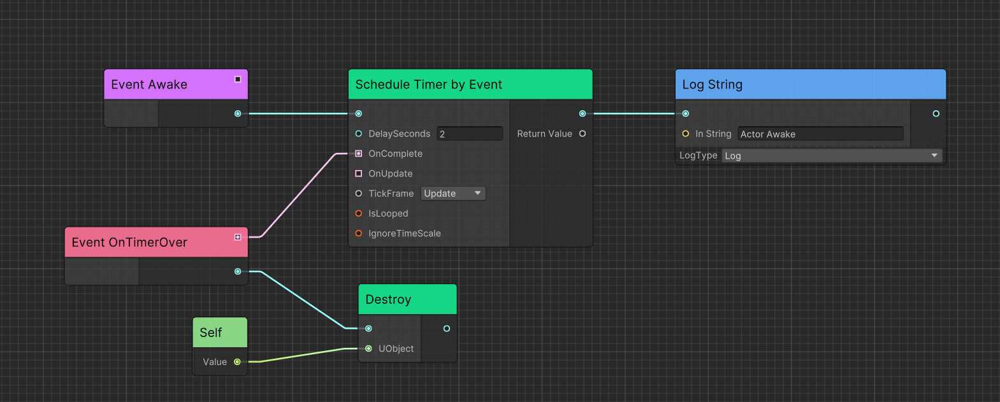

<div align="center">

# Chris Gameplay

Gameplay modules for [Chris](https://github.com/AkiKurisu/Chris) framework.

> Experimental modules for personal project. It will be merged into Chris's repo once the modules are stable.

</div>

## Install

Add following dependencies to `manifest.json`.

```json
  "dependencies": {
    "com.kurisu.chris": "https://github.com/AkiKurisu/Chris.git",
    "com.kurisu.ceres": "https://github.com/AkiKurisu/Ceres.git"
  }
```

Use git URL to download package by Unity Package Manager ```https://github.com/AkiKurisu/Chris.Gameplay.git```.

## Features

### [Gameplay](./Documentation~/Gameplay.md)

Actor based gameplay architecture like Unreal, integrate Ceres to support visual scripting.




### [AI](./Documentation~/AI.md)

AI tools from AAA games research. 


> Field View from "Naughty Dog: Human Enemy AI In Last of The Us"

### [Mod](./Documentation~/Mod.md) 

Mod workflow based on Addressables. 

> Not compatiable to Unity 6 yet.

## Wiki

[Chris Gameplay Wiki](https://deepwiki.com/AkiKurisu/Chris.Gameplay/) generated by [DeepWiki](https://deepwiki.com).

## Credits

[yasirkula/NativeGallery](https://github.com/yasirkula/UnityNativeGallery) - A native plugin to interact with Gallery/Photos on Android & iOS.

[AkiKurisu/Chris](https://github.com/AkiKurisu/Chris) - Development framework.

[AkiKurisu/Ceres](https://github.com/AkiKurisu/Ceres) - Visual scripting toolkit.

## License

MIT